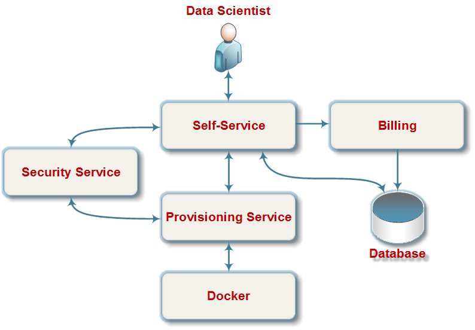

.. dlab documentation master file, created by
   sphinx-quickstart on Thu Aug  1 15:14:13 2019.
   You can adapt this file completely to your liking, but it should at least
   contain the root `toctree` directive.

Welcome to dlab's documentation!
================================

What is DLAB?
--------------
DLab is an essential toolset for analytics. It is a self-service Web Console, used to create and manage exploratory environments. It allows teams to spin up analytical environments with best of breed open-source tools just with a single click of the mouse. Once established, environment can be managed by an analytical team itself, leveraging simple and easy-to-use Web Interface.

Logical architecture
--------------------
The following diagram demonstrate high-level logical architecture.

The diagram shows main components of DLab, which is a self-service for the infrastructure deployment and interaction with it. The purpose of each component is described below.

Self-Service
------------
Self-Service is a service, which provides RESTful user API with Web User Interface for data scientist. It tightly interacts with Provisioning Service and Database. Self-Service delegates all user`s requests to Provisioning Service. After execution of certain request from Self-service, Provisioning Service returns response about corresponding action happened with particular resource. Self-service, then, saves this response into Database. So, each time Self-Service receives request about status of provisioned infrastructure resources – it loads it from Database and propagates to Web UI.

Billing
-------
Billing is a module, which provides a loading of the billing report for the environment to the database. It can be running as part of the Self-Service or a separate process.

Provisioning Service
--------------------
The Provisioning Service is a RESTful service, which provides APIs for provisioning of the user’s infrastructure. Provisioning Service receives the request from Self-Service, afterwards it forms and sends a command to the docker to execute requested action. Docker executes the command and generates a response.json file. Provisioning service analyzes response.json and responds to initial request of Self-Service, providing status-related information of the instance.

Security service
----------------
Security Service is RESTful service, which provides authorization API for Self-Service and Provisioning Service via LDAP.

Docker
------
Docker is an infrastructure-provisioning module based on Docker service, which provides low-level actions for infrastructure management.

Database
--------
Database serves as a storage with description of user infrastructure, user’s settings and service information.

.. toctree::
   structure
   contributing
   plugins
   quick_start
   installation
   cli
   changes
   auto_docs